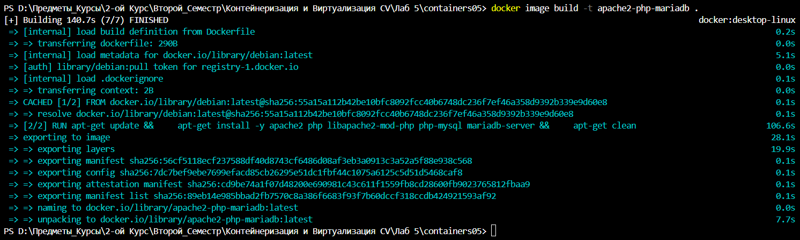
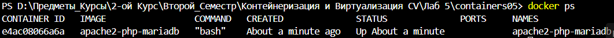
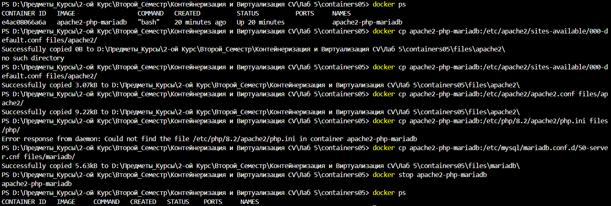
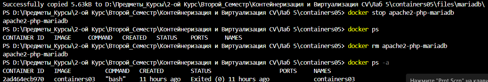
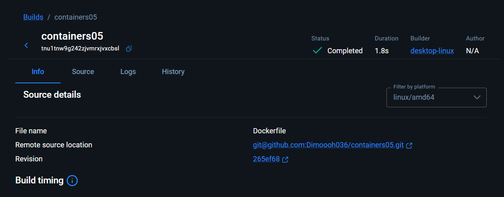
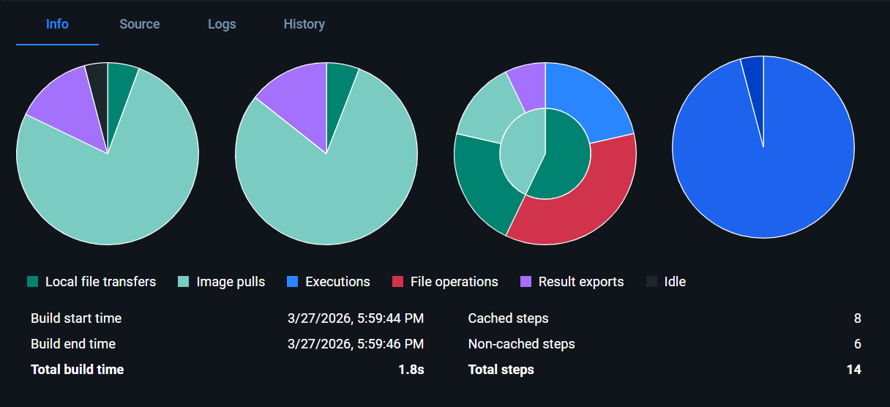
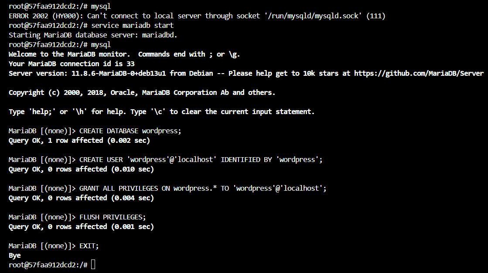
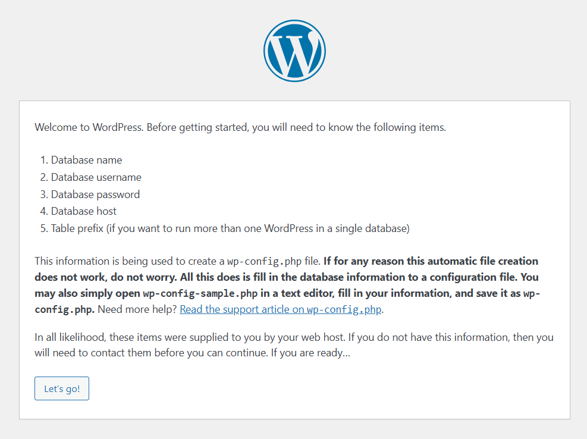

# Запуск сайта в контейнере

## Цель работы

Выполнив данную работу студент сможет подготовить образ контейнера для запуска веб-сайта на базе Apache HTTP Server + PHP (mod_php) + MariaDB.

## Задание

Создать Dockerfile для сборки образа контейнера, который будет содержать веб-сайт на базе Apache HTTP Server + PHP (mod_php) + MariaDB. База данных MariaDB должна храниться в монтируемом томе. Сервер должен быть доступен по порту 8000.

Установить сайт WordPress. Проверить работоспособность сайта.

## Выполнение Работы

### Извлечение конфигурационных файлов apache2, php, mariadb из контейнера

В папке containers05 создал папку files, а также
папку files/apache2 - для файлов конфигурации apache2;
папку files/php - для файлов конфигурации php;
папку files/mariadb - для файлов конфигурации mariadb.
И Создал в папке containers05 файл Dockerfile с необходимым содержимым

Построил образ контейнера с именем "apache2-php-mariadb ."


При Создании Контейнера из образа Вышло:
ash
e4ac08066a6a92993c85bc3273127907d573f1e6fc246c966451afe5e7cdaa97


Скопировал из контейнера файлы конфигурации apache2, php, mariadb в папку files/ на компьютере. Выполнив команды:

После выполнения команд в папке files/ появились файлы конфигурации apache2, php, mariadb. После проверки над наличия я остановил и удалил контейнер apache2-php-mariadb.

### Настройка конфигурационных файлов. Конфигурационный файл apache2

Открыл файл files/apache2/000-default.conf, нашёл строку "#ServerName www.example.com" и заменил её на "ServerName localhost".
Нашёл строку "ServerAdmin webmaster@localhost" и заменил в ней на свой почтовый адрес.
После строки "DocumentRoot /var/www/html" добавил следующую строку:
DirectoryIndex index.php index.html
Сохраните файл и закройте.
В конце файла "files/apache2/apache2.conf" добавил следующую строку:
ServerName localhost

### Конфигурационный файл php

Открыл файл "files/php/php.ini", нашёл строку ";error_log = php_errors.log" и заменил её на "error_log = /var/log/php_errors.log."
Важно! - Когда заменил строку я заодно убрал ";" - оно отвечает за комментарий
Настроил необходимые параметры следующим образом:
memory_limit = 128M
upload_max_filesize = 128M
post_max_size = 128M
max_execution_time = 120
Сохранил файл и закрыл.

### Конфигурационный файл mariadb

Открыл файл "files/mariadb/50-server.cnf", нашёл строку "#log_error = /var/log/mysql/error.log" и раскомментировал её. Убрав "#" - он тоже отвечает как за комментарий
Сохранил файл и закрыл.

### Создание скрипта запуска

Создал в папке "files" папку "supervisor" и файл "supervisord.conf" со всем необходимым содержимым

### Создание Dockerfile

Открыл файл Dockerfile и добавил в него следующие строки:

```Dockerfile
FROM debian:latest
VOLUME /var/lib/mysql
VOLUME /var/log

RUN apt-get update && \
    apt-get install -y apache2 php libapache2-mod-php php-mysql mariadb-server supervisor wget tar && \
    apt-get clean

RUN wget https://wordpress.org/latest.tar.gz -O /tmp/latest.tar.gz && \
    tar -xzf /tmp/latest.tar.gz -C /var/www/html/ && \
    rm /tmp/latest.tar.gz

COPY files/apache2/000-default.conf /etc/apache2/sites-available/000-default.conf
COPY files/apache2/apache2.conf /etc/apache2/apache2.conf
COPY files/php/php.ini /etc/php/8.2/apache2/php.ini
COPY files/mariadb/50-server.cnf /etc/mysql/mariadb.conf.d/50-server.cnf
COPY files/supervisor/supervisord.conf /etc/supervisor/supervisord.conf

RUN mkdir /var/run/mysqld && chown mysql:mysql /var/run/mysqld

EXPOSE 80

CMD ["/usr/bin/supervisord", "-n", "-c", "/etc/supervisor/supervisord.conf"]
```

Собрал образ контейнера с именем "apache2-php-mariadb" и запустил контейнер "apache2-php-mariadb" из образа "apache2-php-mariadb".
Проверил наличие сайта "WordPress" в папке /var/www/html/. Проверил изменения конфигурационного файла "apache2".




### Создание базы данных и пользователя

Создал базу данных "wordpress" и пользователя "wordpress" с паролем "wordpress" в контейнере "apache2-php-mariadb".
Для этого, в контейнере "apache2-php-mariadb", выполнил команды:


### Создание файла конфигурации WordPress

Открыл в браузере сайт "WordPress" по адресу http://localhost/.

И Указал параметры подключения к базе данных:
имя базы данных: wordpress;
имя пользователя: wordpress;
пароль: wordpress;
адрес сервера базы данных: localhost;
префикс таблиц: wp_.
Скопируйте содержимое файла конфигурации в файл files/wp-config.php на компьютере.

### Добавление файла конфигурации WordPress в Dockerfile

Добавил в файл Dockerfile следующую строку:
COPY files/wp-config.php /var/www/html/wordpress/wp-config.php

### Запуск и тестирование

## Ответы на Вопросы

1) Какие файлы конфигурации были изменены?

   В ходе Лаб. раб. были изменены такие файлы как:
   - Dockerfile,
   - wp-config.php,
   - php.ini,
   - apache2.conf,
   - supervisord.conf,
   - 000-default.conf

2) За что отвечает инструкция DirectoryIndex в файле конфигурации apache2?

   В файле 000-default.conf DirectoryIndex указывает, какой файл открывать первым, если пользователь как я заходит в папку без указания файла.
   "DirectoryIndex index.php index.html"
   Сначало первое ищет index.php а потом index.html

3) Зачем нужен файл wp-config.php?

   Файл wp-config.php нужен для того, чтобы файл WordPress мог подключиться к MariaDB.
   Он содержит:
    - параметры подключения к базе данных:
       имя БД
       пользователь
       пароль
       хост
    - секретные ключи безопасности
    - префикс таблиц
    - основные настройки сайта

4) За что отвечает параметр post_max_size в файле конфигурации php?

   Параметр post_max_size определяет максимальный размер данных HTTP POST-запроса, которые PHP может принять.

5) Укажите, на ваш взгляд, какие недостатки есть в созданном образе контейнера?

   - Нарушение принципа one service — one container.
   - Нет разделения данных БД в volume → данные могут потеряться.
   - Отсутствует healthcheck контейнера.
   - Нет автоматической инициализации WordPress.
   - Запуск сервисов через bash/supervisor вместо корректного entrypoint.
   - Большой размер образа.
   - Конфигурация жёстко прописана внутри образа.
   - И самое главное - Если что-то пойдёт не так, обязательно что-то пройдёт не так...

## Выводы

Создал Dockerfile для сборки образа контейнера, с необходимым содержанием веб-сайт на базе Apache HTTP Server + PHP (mod_php) + MariaDB.
База данных MariaDB храниться в монтируемом томе. И Сервер доступен по порту 8000.
Установил сайт WordPress. И Проверил работоспособность сайта.
